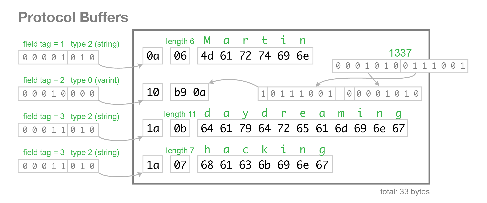

# gRPC presentation



## Components

### Gomonitor

Small gRPC server made in go that will expose CPU usage metrics of its host machine (either one shot or streamed)

### Blazinfra

Blazor SSR app that will connect to the gRPC server and display the CPU usage metrics to the client browsers

## Usage

### Install Go protobuf and grpc toolchain

```shell
go install google.golang.org/protobuf/cmd/protoc-gen-go@v1.31
go install google.golang.org/grpc/cmd/protoc-gen-go-grpc@v1.3
```

### To generate the protobuf interfaces

```shell

# Generate Go interface
protoc -I pb --go_out gomonitor --go-grpc_out gomonitor proto/MonitoringService.proto

# Generate .NET interface
# Nothing to do, it's taken care automatically by grpc tool at build time
```

### How to use ?

```sh
# to build
make build
```

```sh
# To start
make start

Then to go http://localhost:5000/
```

```sh
# To stop
make stop
```

```sh
# to clean
make clean
```

### Improvements

- Go: Implement proper flow control and context management for the streaming to properly terminate the connections (instead of leaving gorouting forever)
